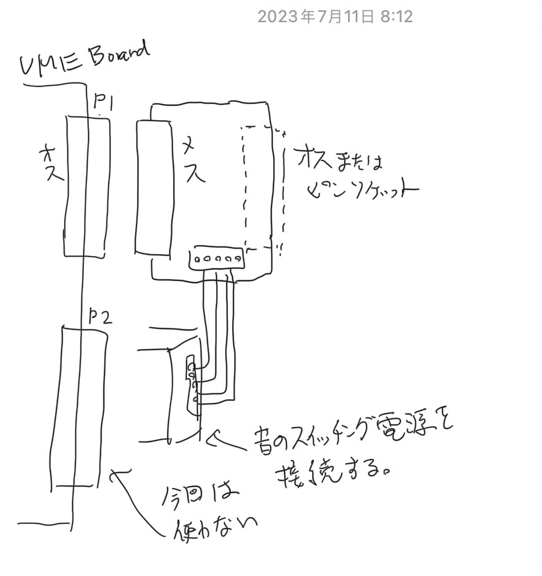
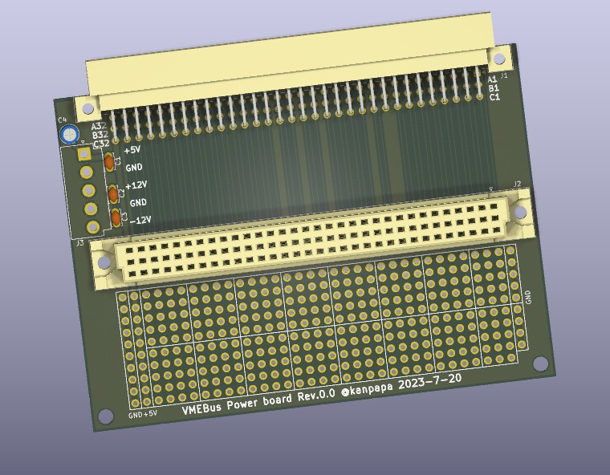

# VME_power

VMEボード P1コネクタのブレイクアウトボードです。VMEボードへの電源の供給およびP1コネクタの信号をすべて引き出せます。

## ボードのアイデア

* VMEbusのP1コネクタから電源（5V, 12V, -12V）を供給します。
* P1コネクタの全信号をコネクタに引き出します。

## KiCadデータ

KiCADで設計からガーバーデータの作成を行いました。

* [回路図](./VME_power_sch.pdf)
* [BOM](./VME_power.csv)

## Breakout boardのイメージ図

## Disclaimer
The contents of this repository are the result of personal research and are provided "as is" without any warranty.